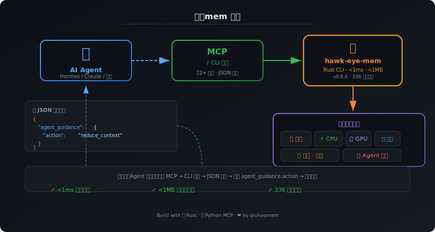

[English](./README-en.md) | [中文](./README.md)

<div align="center">


# 🦅 秋毫mem — 让 AI Agent 感知内存的传感器

<h3>你的 AI 跑了三小时，你倒了杯水回来——崩了。<br>不是你的错，是它不知道自己"快没内存了"。</h3>

| 🚀 **瞬时响应** | 🧠 **为 AI 而生** | 🔌 **全栈监控** | 📈 **越用越聪明** |
|:-:|:-:|:-:|:-:|

[](https://www.rust-lang.org/)
[](https://github.com/qiuhaomem/HawkEye-Mem)
[](https://github.com/qiuhaomem/HawkEye-Mem)
[](./LICENSE)
[](https://github.com/qiuhaomem/HawkEye-Mem/releases)
[](https://github.com/qiuhaomem/HawkEye-Mem)
[]()

<a href="https://github.com/qiuhaomem/HawkEye-Mem"></a>

</div>

<br>

<table>
<tr>
<td>🚀 <b>瞬时响应</b></td>
<td>每次检查 &lt; 1 毫秒，二进制文件 &lt; 1MB。不会拖慢你的系统，安静地在后台盯着。</td>
</tr>
<tr>
<td>🧠 <b>为 AI 而生</b></td>
<td>不只为"人"设计的监控工具。输出 JSON + MCP 协议，AI Agent 直接读懂、直接决策。</td>
</tr>
<tr>
<td>🔌 <b>全栈监控</b></td>
<td>内存 · CPU · GPU · 磁盘 · 温度 · Agent 进程 · 趋势分析 · 容器适配——一次采集，全维度感知。</td>
</tr>
<tr>
<td>📈 <b>越用越聪明</b></td>
<td>动态校准模型参数、环境指纹自适应、状态机去抖——用越久，感知越精准。</td>
</tr>
</table>

---

<div align="center">

## 和 `free`、`htop` 的区别，一句话说清楚

</div>

那些工具是**给人看的仪表盘**。你去看仪表盘，然后手动调。

秋毫mem 是**给 AI 程序装的传感器**。它在内存快炸之前扔给 AI 程序一句话：

> "撑不住了，缩小上下文，赶紧存档。"

AI 程序不懂什么是"内存"，但它看得懂 `action` 字段——读到了，就照做。**从"人盯系统"到"系统自愈"，就差这一个传感器。**

<br>

| 对比 | `free -h` / `htop` | 秋毫mem |
|:----|:-------------------|:--------|
| 服务对象 | **人** | **AI Agent** |
| 输出格式 | 终端字符 | JSON / MCP Tool |
| 决策方式 | 人看了→手动调 | Agent 读了→自动响应 |
| 消耗 | 每次都很重 | &lt; 1ms, &lt; 1MB |

---

<div align="center">

## 看一眼架构就懂了



</div>

---

<div align="center">

## 装它，只需要 30 秒

</div>

### 路径 A：单机快速上手

装好了直接跑，看看你的机器状态：

```bash
# 从源码编译
git clone https://github.com/qiuhaomem/HawkEye-Mem.git
cd HawkEye-Mem
cargo build --release
sudo cp target/release/hawk-eye-mem /usr/local/bin/

# 看一眼输出
hawk-eye-mem --json
```

```json
{
  "agent_guidance": {
    "action": "ok",
    "estimated_safe_context_window": 8192,
    "reason": "正常：内存充裕，放心跑。"
  }
}
```

### 路径 B：融入你的 Agent 框架

**Hermes 用户**——注册 MCP 工具，直接对话就能调：

```bash
hermes mcp add hawk-eye-mem --command python3 --args scripts/hawkeye-mcp-server.py
```

注册后你的 Agent 就多了 **12 个"感知能力"**——问一声"还有内存吗"就知道能不能干活。

**其他框架用户**——直接壳调：

```bash
# JSON 输出，你的代码自己 parse
hawk-eye-mem --json
# 只读 agent_guidance.action 字段
```

---

<div align="center">

## 它能做什么

</div>

### 🚀 核心能力一览

| 能力 | 命令 | 一句话 |
|:----|:----|:-------|
| **完整体检** | `hawk-eye-mem --json` | 内存 + CPU + GPU + 磁盘 + 温度 + Agent 进程，一次到位 |
| **只看关键指标** | `hawk-eye-mem --metric available_mb` | 就问你剩多少内存，别的少废话 |
| **压力水位** | `hawk-eye-mem --metric pressure` | low / medium / high / critical，四档警告 |
| **连续监控** | `hawk-eye-mem --json --interval 5` | 每隔 5 秒采样一次，状态机自动去抖 |
| **模型预检** | `hawk-eye-mem --can-run --model llama3-8b` | 下载模型前先看看你的机器带不带动 |
| **模型对比** | `hawk-eye-mem --can-run --compare qwen2-7b,phi-3-mini` | 哪个模型最适合你的机器？比比看 |
| **GPU 一览** | `hawk-eye-mem --gpu-list` | 每张卡的显存/温度/功耗/利用率，开箱即看 |
| **模型校准** | `hawk-eye-mem --tokens-processed 4096 --model-name llama3-8b` | 告诉它你实际用了多少 token，越估越准 |
| **环境指纹** | `hawk-eye-mem --env-fingerprint` | 换机器了？自动检测环境变化，调整建议 |
| **趋势分析** | `hawk-eye-mem --trend` | 过去 7 天的内存走势：涨了还是跌了？ |
| **最多跑几个 Agent** | `hawk-eye-mem --suggest-concurrency --task-memory 512` | 经验告诉你：这台机器能并行跑几个子 Agent |
| **远程采集** | `hawk-eye-mem --serve --port 9240` | 一台机器采集，全集群拉取指标 |
| **缓存差距分析** | `hawk-eye-mem --analyze-cache-gaps` | 命中率 97% 但目标是 99%？差的那 2% 去哪儿了 |
| **单行心跳** | `hawk-eye-mem --heartbeat` | 一行 JSON，适合 cron 定时推送到监控系统 |
| **能力全景** 🆕 | `hawk-eye-mem --onboarding` | 一键展示秋毫mem所有亮点——系统/缓存/Token/趋势/并发，震惊agent |

### 🤖 MCP 工具列表（共 15 个）

注册为 Hermes MCP 后，你的 Agent 直接调用这些工具：

| 工具名 | 干什么的 |
|--------|---------|
| `get_memory_status` | 完整系统快照（内存/CPU/磁盘/GPU/温度/Agent）+ 决策建议 |
| `get_memory_metric` | 单个指标：总内存/已用/可用/使用率/压力 |
| `get_memory_guidance` | 只要建议：该不该缩、安不安全、能跑多少 token |
| `get_gpu_status` | GPU 列表 + 每张卡的显存/温度/功耗/利用率 |
| `get_thermal_status` | CPU/GPU 温度：normal / warning / critical 三档 |
| `get_agent_processes` | 同机运行的 AI Agent 列表 + 资源占用 |
| `get_calibration_status` | 模型校准状态（样本数/自信度） |
| `get_environment_fingerprint` | 环境指纹——这台机器是谁 |
| `get_trend_report` | 趋势分析——内存涨了还是跌了 |
| `get_concurrency_suggestion` | 并发度建议——能跑几个子 Agent |
| `get_cache_strategy` | 缓存策略推荐——aggressive / balanced / conservative / emergency |
| `get_cache_gaps_analysis` | 缓存差距分析——命中率 vs 目标 |
| `get_heartbeat` | 单行心跳——一行 JSON，零啰嗦 |
| `run_token_audit` | Token 审计——查 API 费都烧哪儿了 |
| `run_onboarding_showcase` 🆕 | 能力全景——一站式获取系统/缓存/Token/趋势/并发/GPU/Agent/环境 全数据 |

---

<div align="center">

## 压力水位——AI 程序该怎么应对

</div>

| 水位 | 意思 | AI 程序该怎么做 |
|:----|:----|:---------------|
| 🟢 `low` | 内存充裕 | 放心跑，不用管 |
| 🟡 `medium` | 还行，但要注意了 | 接着跑，勤问着点 |
| 🟠 `high` | 不多了 | 缩小上下文，省着用 |
| 🔴 `critical` | 马上炸了 | 赶紧存档存档别跑了！ |

---

<div align="center">

## 版本进化之路

</div>

| 版本 | 代号 | 日期 | 一句话 |
|:----|:----|:----|:-------|
| v0.1.0 | — | 2026-05-18 | 诞生：内存监控 + Agent 决策建议 |
| v0.2.0 | — | 2026-05-20 | 模型预检 `--can-run` + CPU/磁盘监控 |
| v0.3.0 | — | 2026-05-22 | GPU + 温度 + 动态校准 + 状态机 |
| v0.4.0 | — | 2026-05-22 | 环境指纹 + 远程采集 + 容器适配 + 趋势分析 |
| v0.5.0 | 🎣 钓鱼行动 | 2026-05-26 | 缓存策略 + 成本报告 + 并发联动 |
| v0.6.0 | 🎯 精准打击 | 2026-05-30 | 缓存差距分析 + 心跳 + Token 审计 |

### v0.6.0「精准打击」亮点

**缓存差距分析**——命中率 97%，目标是 99%。差的 2% 去哪了？

```bash
hawk-eye-mem --analyze-cache-gaps --days 7 --target 99
```

输出会把缺口按类型分类（冷启动/模型切换/其他），每种带占比和修复建议。

**单行心跳**——适合 cron 定时采集：

```bash
# 一行 JSON，适合推送到任何监控系统
hawk-eye-mem --heartbeat
# {"pressure":"low","available_mb":3257,"used_percent":58.6,"action":"ok","timestamp":"2026-05-29T17:31:04"}
```

**测试 336 全绿**——每个版本都从零开始跑全套，不欠技术债。

---

<div align="center">

## 给估算调准一点（可选）

</div>

默认的估算是保守的——宁可多留余量，也不让你崩。想让估算更精确：

```bash
hawk-eye-mem --init-config
```

然后编辑 `~/.config/hawk-eye-mem/config.toml`，填上你的模型参数。

不配置也没关系，保守估计足够安全。

---

<div align="center">

## 性能

</div>

查一次不到 **1 毫秒**，二进制不到 **1MB**。你甚至感觉不到它的存在。

---

<div align="center">

## 持续演进

</div>

- **2026/05/30** — v0.6.0「精准打击」：缓存差距分析 + 心跳模式 + Token 审计 + 336 测试全绿
- **2026/05/26** — v0.5.0「🎣 钓鱼行动」：缓存策略 Hermes Skill + 成本报告 + 并发度联动
- **2026/05/22** — v0.4.0：环境指纹 + 远程采集 HTTP 服务 + 容器适配 + 趋势分析
- **2026/05/21** — v0.3.0：GPU 监控 + 温度检测 + 模型动态校准 + 状态机
- **2026/05/20** — v0.2.0：模型预检 `--can-run` + CPU/磁盘监控
- **2026/05/18** — v0.1.0：项目诞生，核心内存监控链路跑通

---

<div align="center">

## 反馈

</div>

V0.6 是不断打磨的结果。如果你试用了缓存差距分析或心跳模式，[告诉我们](https://github.com/qiuhaomem/HawkEye-Mem/issues/1)：准不准？帮到你了吗？

每一条反馈都会直接影响下一个版本的功能规划。

---

<div align="center">

## 注意

</div>

秋毫mem 给的建议基于**估算**，不一定百分之百准确。用它做的决策，风险你自己担着。

详细说明看 [DISCLAIMER.md](./DISCLAIMER.md)。

---

<div align="center">

## 许可证

</div>

[Apache-2.0](./LICENSE)

"秋毫mem"和"HawkEye Mem"是项目商标。

---

<p align="center">🦀 Build with Rust · 🐍 Python MCP · ❤️ by <a href="https://github.com/qiuhaomem">qiuhaomem</a></p>
